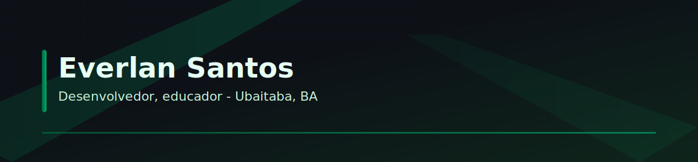

  

  <a href="https://www.linkedin.com/in/everlandev">LinkedIn</a> ·
  <a href="mailto:santoseverlan29@gmail.com">E-mail</a> ·
  <a href="https://github.com/snugbX">GitHub</a>

---

### Stack principal

  
  
  
  
  
  
  

---

### Métricas
<table align="center" width="100%">
  <tr>
    <td align="center" width="60%">
      
       Linguagens + calendário 3D
    </td>
    <td align="center" width="40%">
      
       Achievements
    </td>
  </tr>
  <tr>
    <td colspan="2" align="center">
      
    </td>
  </tr>
</table>

---

### Projetos em destaque
- 🚗 **Sistema para gerenciamento de veículos elétricos** — Angular + Spring Boot.  
- 🎲 **LoteriasGame** — geração de jogos com análise/ML (Flask + JS).  
- 🎮 **Jogo da Velha com IA** — 

<i>Sempre aprendendo e contribuindo para projetos com impacto real.</i>

